# Table of Contents

- [Tech](#tech)
- [Hosting and Deployment](#hosting-and-deployment)
- [Backups](#backups)
- [Authentication](#authentication)
- [User Pages](#user-pages)
  - [Overview](#overview)
  - [Current Team](#current-team)
  - [Points](#points)
  - [Leagues](#leagues)
  - [Transfers](#transfers)
  - [Stats](#stats)
  - [Charts](#charts)
  - [Highlights](#highlights)
  - [Fixtures](#fixtures)
  - [Feature Request](#feature-request)
  - [Account Profile](#account-profile)
- [Admin Pages](#admin-pages)
  - [Create and Delete](#create-and-delete)
  - [Submit Result](#submit-result)
  - [Trigger Week](#trigger-week)
  - [Edit Player](#edit-player)
  - [Approve Highlights](#approve-highlights)
  - [Manage Subs](#manage-subs)
  - [Toggle Pages](#toggle-pages)
  - [Manage Users](#manage-users)

## Tech

- React Redux
- Material UI for styling
- Firebase backend
  - Authentication
  - Hosting
  - Cloud Functions
- GitHib actions for deployment

## Hosting and Deployment

- The production site App is hosted at <https://ccafc-fantasy-football.web.app/>
- The development site App is hosted at <https://ccafc-fantasy-football-dev.web.app/>

  - Merging to master will deploy to prod
  - Merging to develop will deploy to dev

## Backups

- Backups of the whole database are performed daily
- Once a backup has been alive for 7 days, it is moved to coldline storage
- Once alive for 30 days, it is deleted
- Can restore from any existing backup

## Authentication

Users can be authenticated via

- Google Account
- Facebook Account
- Email + Email Verification

## User Pages

- ### Overview

  - Total Points
  - Average Points
  - Your Weekly Points
  - Max Weekly Points
  - Can toggle between weeks
  - Remaining Budget / Transfers (Potentially to be removed)
  - Clicking your points or max takes you to that team for that week
  
  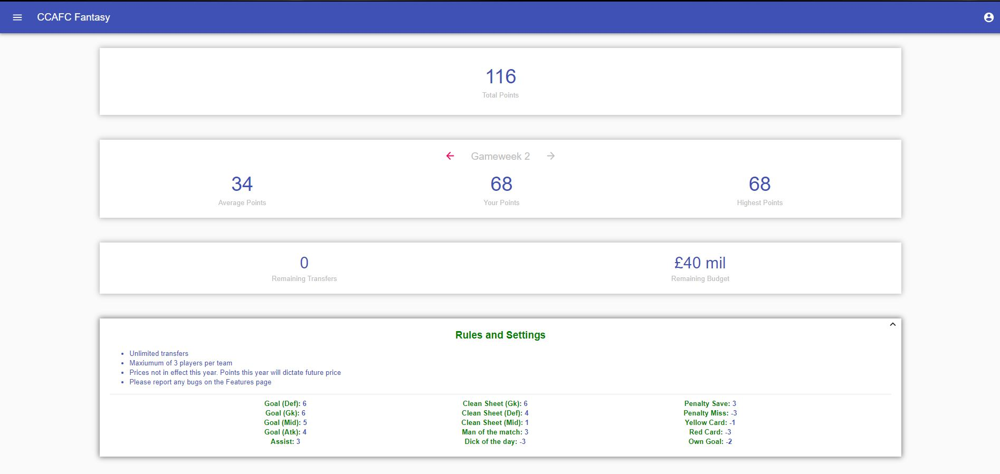

- ### Current Team
  
  - All players in your current team, with the team they belong to
  - Shows your captain (if you have made one)
  - Ability to set captain from clicking on player, or sidebar on the right (for desktop only)
  - Shows the upcoming match for each player in your current team (desktop only)

    

- ### Points

- Shows the points each of your players got in a given week
- Can toggle between weeks
- Clicking a player gives a breakdown of their points
- Sidebar shows username, teamname, points, goals and assists that week + display photo (desktop only)

 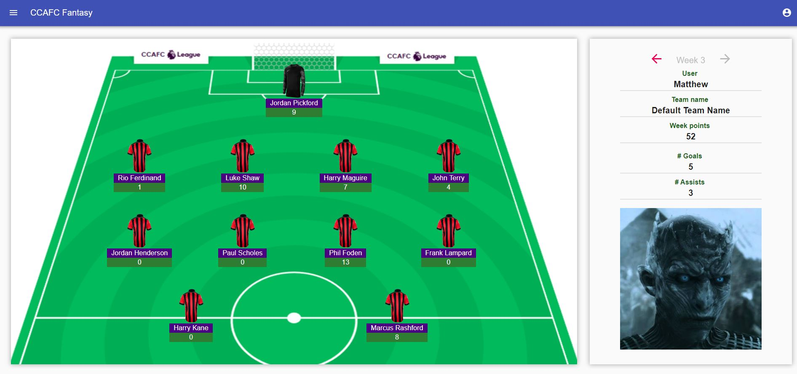

- ### Leagues

- Show all of the leagues you are in and the position you are in for each league
- Clicking a league shows you the league in more detail
- Can create and join leagues (can't have two leagues with the same name)
- No option yet to remove people from leagues

   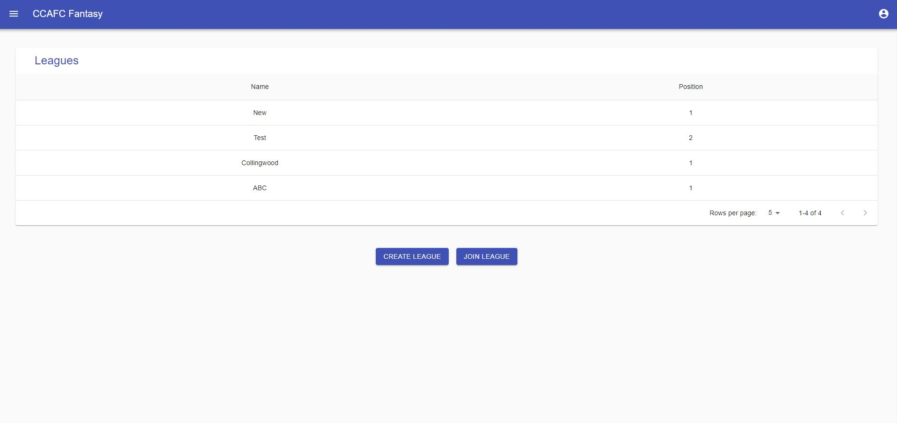

- ### Transfers

- Users can make their team on this page
- Standard formations
- Can choose the max players from a single team
- Can search through all players and filter them by various stats
- Complicated page, possible bugs (shout if you ever find any)
- Also shows next fixture for each team (scraped from Team Durham website and formatted nicely)

 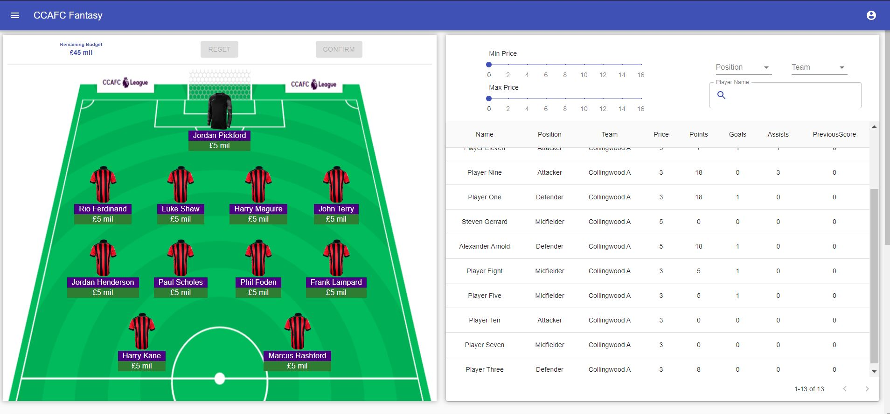
 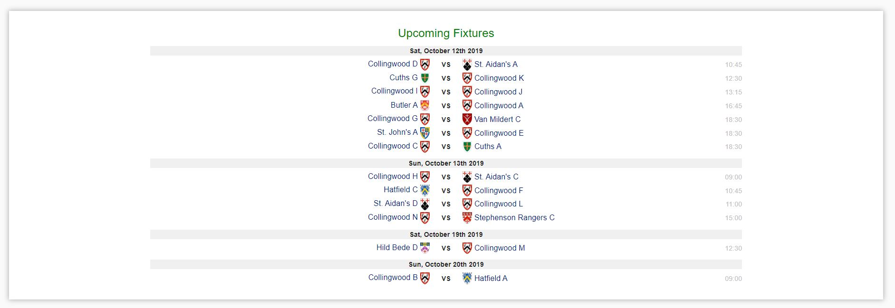

- ### Stats

- Shows the stats for a team across various weeks
- Can filter the week period
- Can filter which stats to see
- Can combine all weeks into one or see them individually

 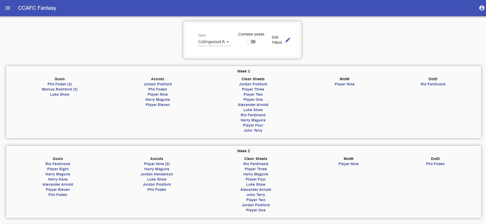

- ### Charts

- Shows charts for any college team in Durham
- Stats scraped from Team Durham website
- Plots Total Points, Goals Scored, Goals Conceded
- Shows league table with all Collingwood teams record

  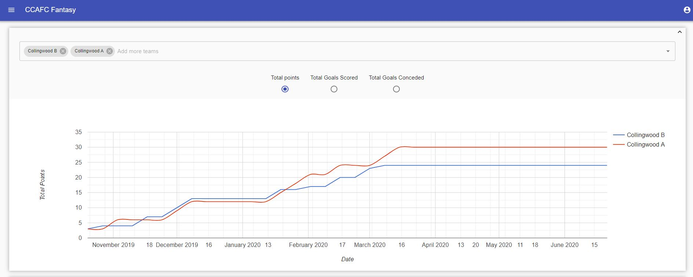
  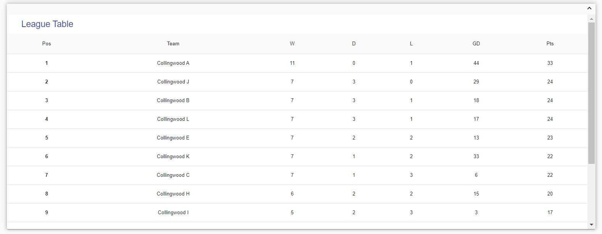

- ### Highlights

- Can submit YouTube videos
- Videos must be approved by an admin
- Videos can be upvoted / downvoted
- Max of 3 submissions to be awaiting approval at any point
- Can comment and reply on the videos

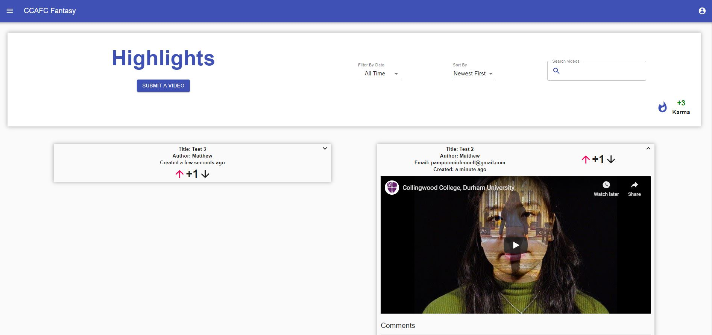

- ### Fixtures

- Fixtures page shows all fixtures (scraped from Team Durham website)
- Can filter fixtures in various ways
- Can set the team you play for to see just fixtures for your team

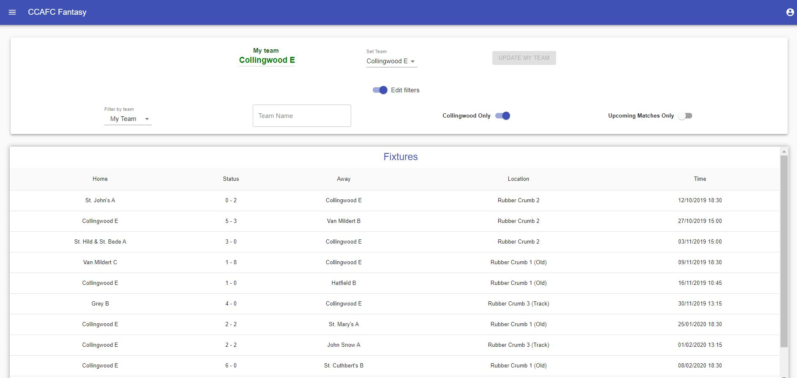

- ### Feature Request

- Users can submit feature requests (ideas they want added to the site)
- They can also submit bugs (these don't appear in the list)

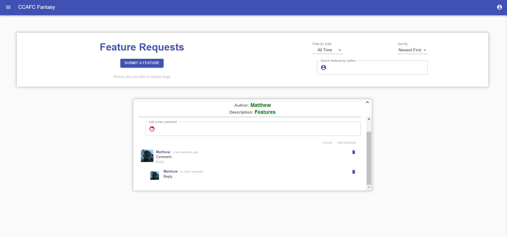

- ### Account Profile

- Users can set their display name, team name and photo
- Users can also link their Google and Facebook accounts
- They can also delete their accounts

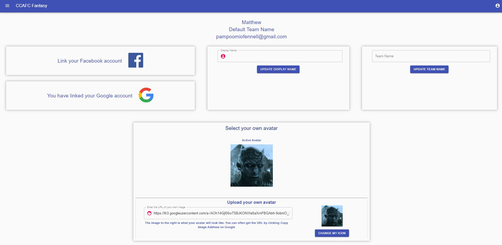

## Admin Pages

- These pages are for users with certain roles only

- ### Create and Delete

- Users with the role maintainer can create / delete entities
- This includes Teams and Players
- Every player must belong to a team
- Can't delete teams that have players associated to them
- Can't have two players with identical information

- ### Submit Result

- This is the page where results get entered in
- Entering results here must be done after triggering the week end
- Enter in goals, assists, MOM, DOTD for each result
- Can add in extra stats (red / yellow cards) separately
- Adding points in should update points everywhere (very complicated, possible bugs)
- Quite important to do this correctly, hard to undo

  
- ### Trigger Week

- This page triggers the end of the game week (extremely important)
- This locks in each users team for that week
- For e.g. gameweek 3 should be locked in just before the gameweek 3 matches start
- Up to maintainer to determine when gameweeks start / end
- Impossible to undo

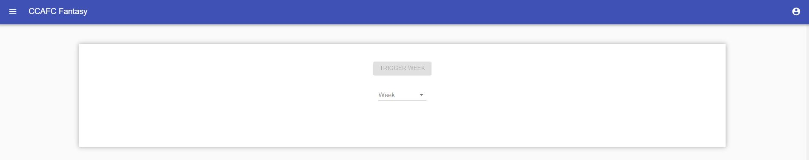

- ### Edit Player

- This page is used to edit the history stats for an individual player
- Not tested this extensively
- To be used mainly for mistakes made when entering in stats
- Must select the team, player and week

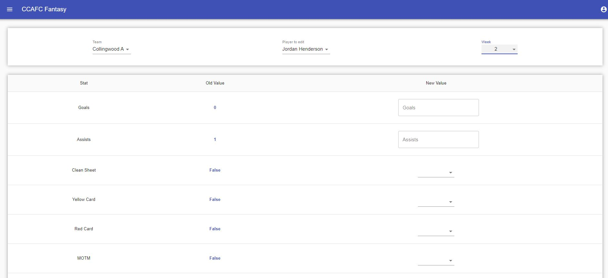

- ### Approve Highlights

- This is the admin page where users with the highlight approver role can approve highlights
- Please give a reason for rejections
- Can reapprove rejected highlights, as well as delete approved highlights

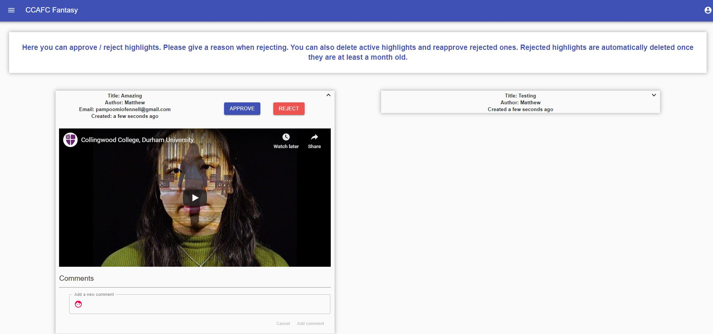

- ### Manage Subs

- This page is to be optionally used by treasurers to manage who has and hasn't paid subs
- Players are generated from all the players made in the Create Player page
- Can toggle players who have and haven't paid

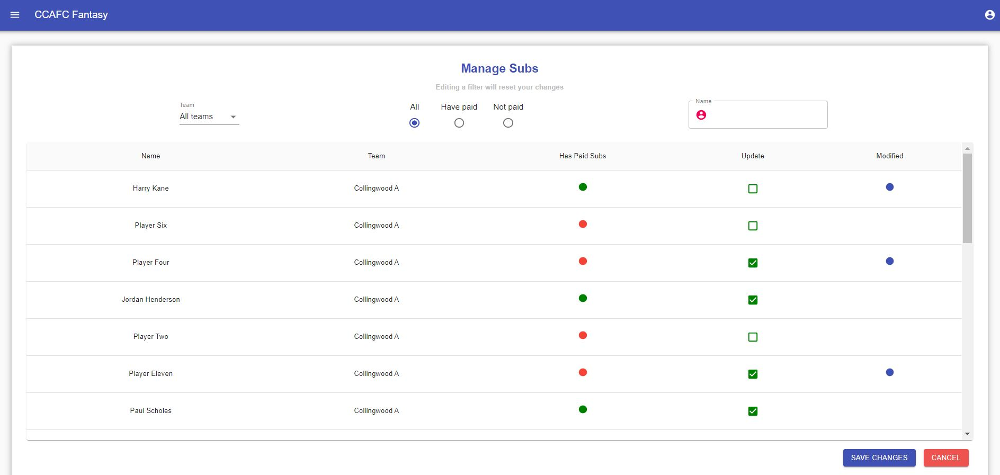

- ### Toggle Pages

- This page can be used to turn pages off
- To be used if
  - App becoming too expensive due to certain pages
  - Breaking bug exists on a page (temporarily disable the page)
  - Overview page must permanently be available

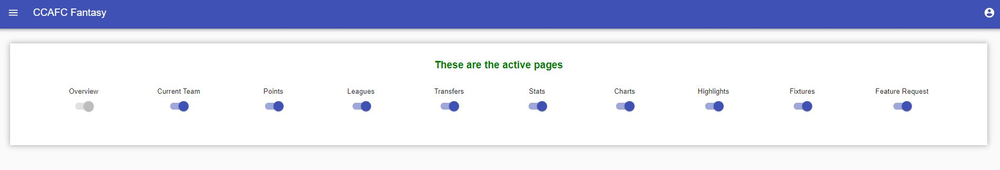

- ### Manage Users

- This page is to be used just by me (probably)
- Used to add permissions to different users
- This allows them to perform different actions / have access to certain pages

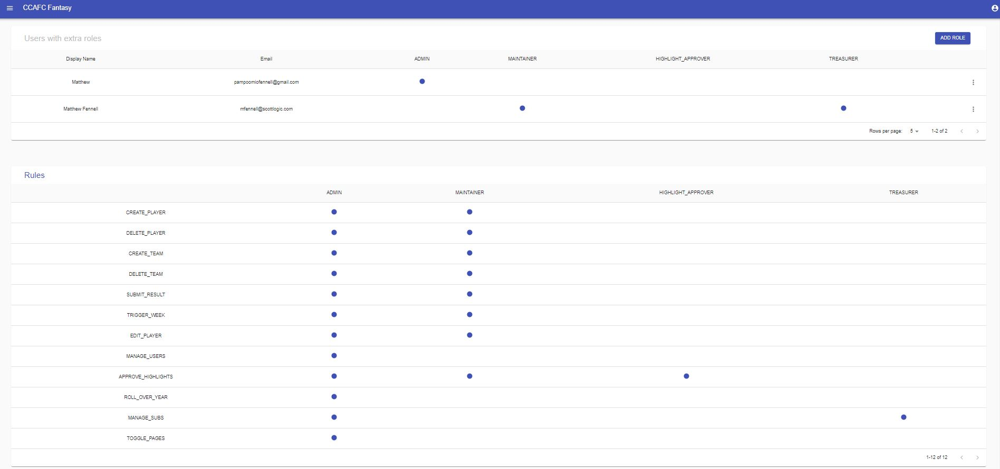
